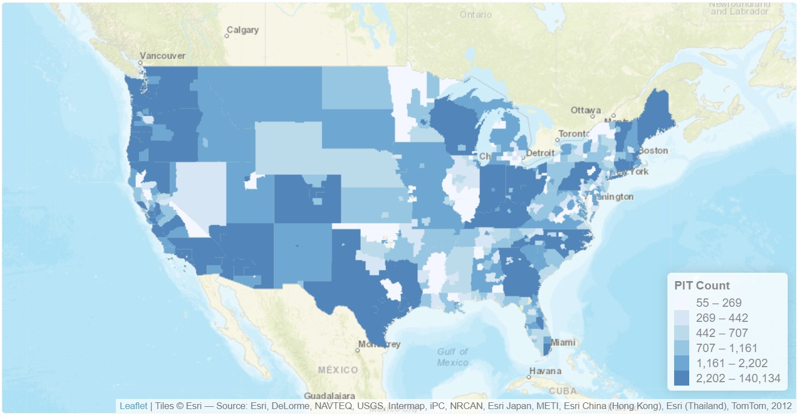
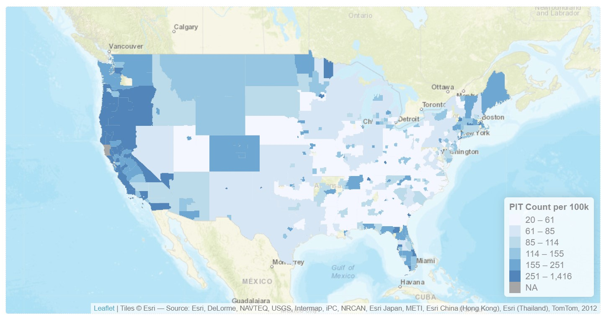
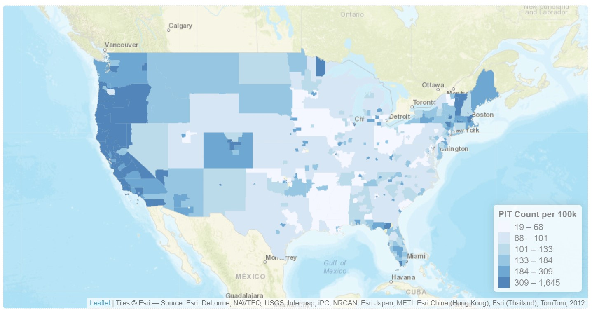
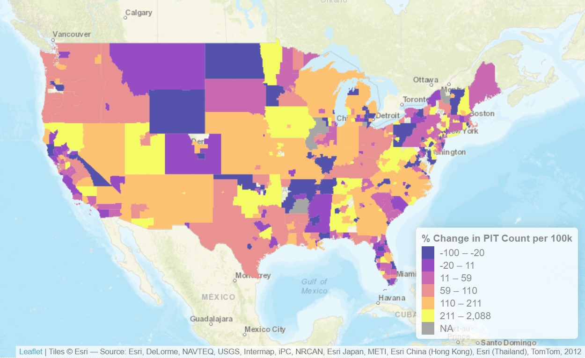

```{r message = FALSE, echo=FALSE}
library(leaflet)
library(tidyverse)
library(ggplot2)
library(ggthemes)
library(scales)
library(sf)

```

```{r message=FALSE, echo=FALSE}
pit_df <- read.csv("data/pit_by_coc_concat.csv")

pit_by_year_df <- pit_df |> 
  group_by(Year) |>
  summarise(Overall.Homeless = sum(Overall.Homeless, na.rm = TRUE), 
            Sheltered.Total.Homeless = sum(Sheltered.Total.Homeless, na.rm = TRUE),
            Unsheltered.Homeless = sum(Unsheltered.Homeless, na.rm = TRUE)) |>
  gather(key="Count.Type", value = "Count", -Year)


cocs_2017 <- read_sf("data/CoC_GIS_NatlTerrDC_Shapefile_2017/FY17_CoC_National_Bnd.gdb", "FY17_CoC_National_Bnd") 

cocs_2017 <- cocs_2017 |>
  filter(!(ST %in% c("GU", "HI", "AK", "VI", "PR")))
cocs_2017 <- st_make_valid(cocs_2017)

cocs_2017 <- st_transform(cocs_2017, 4326)

pit_2017_df <- pit_df |>
  filter(Year == 2017) |>
  select(CoC.Number, CoC.Name, Overall.Homeless, Sheltered.Total.Homeless, Unsheltered.Homeless)

cocs_2017 <- cocs_2017 |> inner_join(pit_2017_df, by=join_by(COCNUM == CoC.Number))

cocs_2024 <- read_sf("data/CoC_GIS_National_Boundary_2024/CoC_GIS_National_Boundary.gdb", "FY24_CoC_National_Bnd") 

cocs_2024 <- cocs_2024 |>
  filter(!(ST %in% c("GU", "HI", "AK", "VI", "PR")))
cocs_2024 <- st_make_valid(cocs_2024)

cocs_2024 <- st_transform(cocs_2024, 4326)

pit_2024_df <- pit_df |>
  filter(Year == 2024) |>
  select(CoC.Number, CoC.Name, Overall.Homeless, Sheltered.Total.Homeless, Unsheltered.Homeless)

cocs_2024 <- cocs_2024 |> inner_join(pit_2024_df, by=join_by(COCNUM == CoC.Number))
```

## Annual Homelessness Assessment Report (AHAR)

Systematically tracks homeless population data in the US

Began in 2007

Conducted by HUD

## Data comes in two parts

Point in Time (PIT) Counts

```         
track the total number of sheltered and unsheltered homeless individuals

Also gathers demographic data about homeless populations (race, age, family status, etc.)
```

Housing Inventory Counts (HIC) track number of beds available

## PIT Trends Since 2007

```{r}

ggplot(pit_by_year_df,aes(x=Year, y = Count, colour = Count.Type)) + 
  geom_line() +
  labs(x = "Year", y = NULL, colour = NULL) +
  scale_x_continuous(breaks = breaks_width(2)) +
  scale_y_continuous(label=label_number(scale = 1e-3, suffix = "k", big.mark = ","))


```

## Continuum of Care

::: {.callout-tip appearance="minimal" icon="false"}
### [Definition]{.smallcaps}

*local planning bodies responsible for coordinating the full range of homelessness services in a geographic area, which may cover a city, county, metropolitan area, or an entire state*
:::

The basic geographic unit of AHAR data

Can be a county, city, or even an entire state

Report does NOT include other demographic data about CoCs (e.g.: population)



## Solution: Geographic Crosswalks

Crosswalks are a method for matching data from one set of geographic units to another, overlapping set

Examples: Congressional Districts to Counties

Census data is recorded by census tracts; by creating a crosswalk between the two, we can determine overall population counts for CoCs

## 

@byrne2013 produced a crosswalk matching CoCs and Census Tracts using centroids

Unfortunately it was last updated in 2017; code is available, but uses defunct libraries and can not be rerun

```{r}
tract_coc_match_2017_df <- read.csv("data/output_2017/tract_coc_match.csv")

tract_coc_match_2017_df |>
  select(coc_number, tract_fips, total_population, total_pop_in_poverty)

```

## Step 1: Recreate the 2017 Data

```{r}

coc_population_comparison_df <- read.csv("data/output_comparison/coc_population_COMPARISON.csv")

coc_population_comparison_df <- coc_population_comparison_df |>
  mutate(pop_diff = abs(total_population_DIFF))


coc_population_comparison_df <- coc_population_comparison_df |>
  mutate(pop_diff_bin = case_when(pop_diff == 0 ~ "0%",
                                  pop_diff < 1 ~ "0-1%",
                                  pop_diff < 5 ~ "1-5%",
                                  pop_diff < 10 ~ "5-10%",
                                  .default = ">10%")) |>
  mutate(pop_diff_bin = factor(pop_diff_bin, levels = c("0%", "0-1%", "1-5%", "5-10%", ">10%")))

ggplot(coc_population_comparison_df, aes(x=pop_diff_bin)) +
  geom_bar()+
  xlab("% Difference in Total Population")

```

## 



## Step 2: Running on 2024 Data



## What's Changed?



## References
